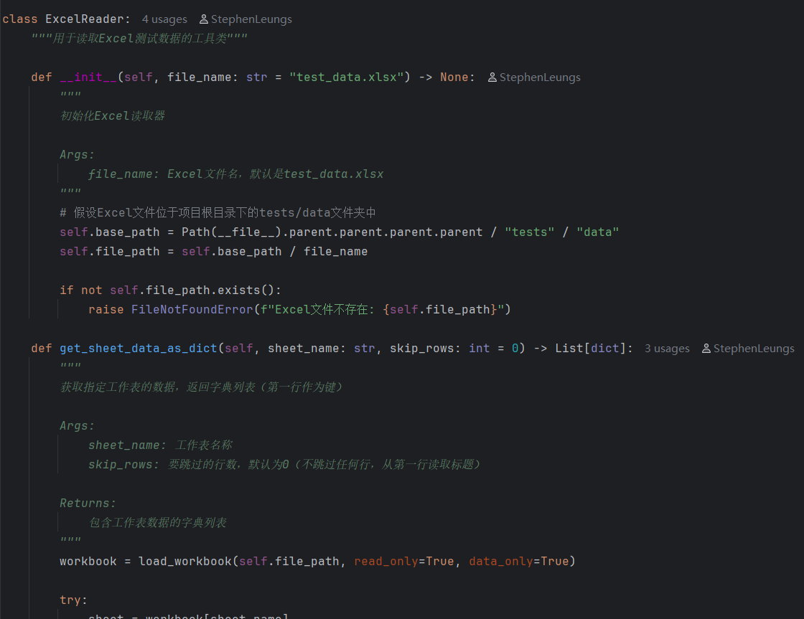
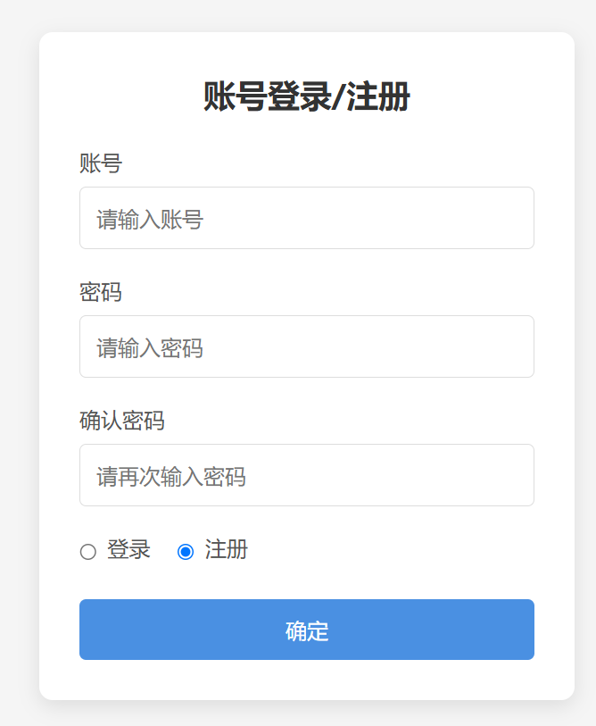
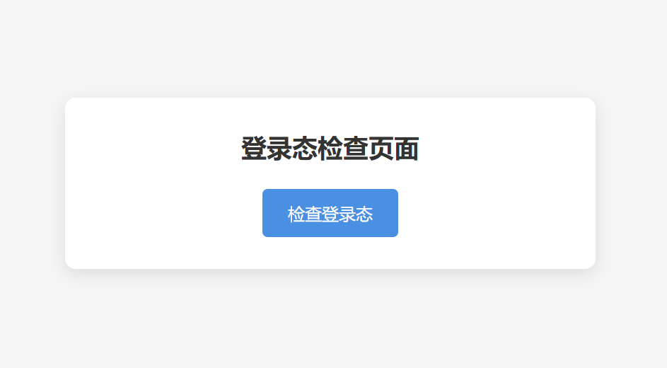
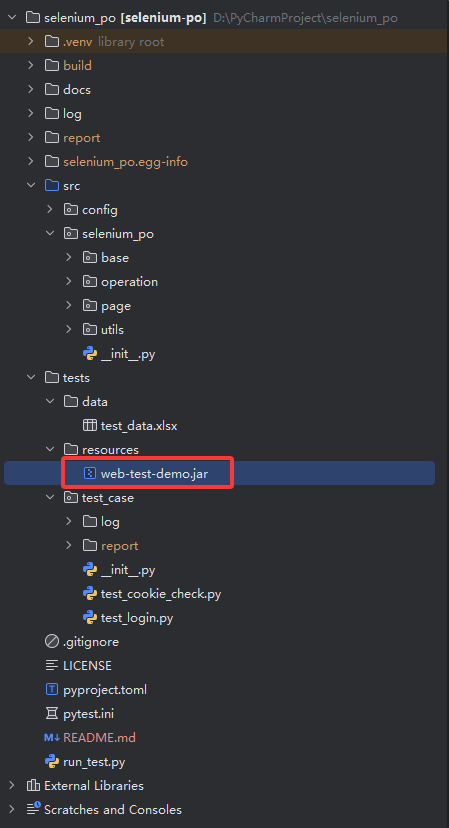
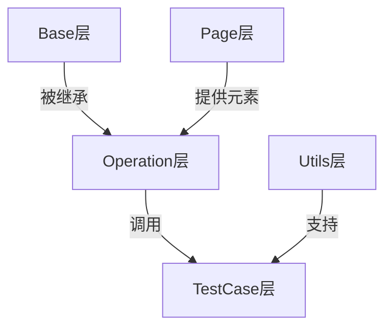

## 项目简介

本项目是一个开源的基于 **Python** 和 **PO模型** 封装的WebUI自动化测试框架Demo，具有以下特点：

✅ **兼容性强**：<span style="background:#ffeb3b;padding:2px 5px;border-radius:3px">基于Python 3.8编写，最低兼容Python 3.8</span>  
✅ **规范注释**：所有类和方法均使用PEP 257规范及Google风格，添加了注释，以便于理解各个类和方法的调用及执行逻辑  
✅ **开源协议**：遵循MIT条款([查看详情](LICENSE))

### 注释示例



## 项目结构

```bash
selenium-po/
├── src/    # 项目源码目录
│   ├── config/    # 项目配置
│   │   ├── __init__.py
│   │   └── logging_config.py    # 日志配置
│   └── selenium_po/    # 测试框架封装
│       ├── __init__.py
│       ├── base/    # 基础操作封装
│       │   ├── __init__.py
│       │   └── base_action.py
│       ├── operation/    # 页面操作类
│       │   ├── __init__.py
│       │   ├── cookie_check_page_operation.py
│       │   └── login_page_operation.py
│       ├── page/    # 页面元素类
│       │   ├── __init__.py
│       │   ├── cookie_check_page.py
│       │   └── login_page.py
│       └── utils/    # 工具类
│           ├── __init__.py
│           ├── driver_utils.py
│           └── excel_reader.py
├── tests/    # 测试代码目录
│   ├── data/    # 测试数据
│   │   └── test_data.xlsx
│   ├── resources/    # 测试资源
│   │   └── web-test-demo.jar
│   └── test_case/    # 测试用例
│       ├── __init__.py
│       ├── test_cookie_check.py
│       └── test_login.py
├── log/    # 日志目录
│   └── .gitkeep
├── .gitignore
├── LICENSE    # 许可证条款
├── pyproject.toml    # 项目配置(依赖)管理
├── pytest.ini    # pytest配置文件
└── run_test.py    # 运行入口
```

## 

## 技术栈

| 作用            | 三方库                  |
| ------------- | -------------------- |
| **Web测试框架**   | selenium             |
| **单元测试框架**    | pytest               |
| **控制用例执行顺序**  | pytest-order         |
| **失败重试**      | pytest-rerunfailures |
| **测试报告生成**    | allure-pytest        |
| **Excel数据处理** | openpyxl             |
| **日志框架**      | logging              |
| **浏览器驱动管理**   | webdriver-manager    |

## 

## 🚀 快速启动指南

### 调试网页说明

项目包含本地可部署的网页Demo（约2MB），包含两个简单页面：

1. **注册登录页**  
   
   
   
   访问地址：`http://127.0.0.1:8080/login`

2. **登录态检查页**  
   
   
   
   访问地址：`http://127.0.0.1:8080/cookie_check`

> 📍 **Demo位置**：`tests/resources/web-test-demo.jar`  
> 
> 

#### 特点：

- ✅ **一键部署**：`java -jar` 即可运行（无需Tomcat/数据库）

- ⚠️ **数据临时性**：每次运行清空上次数据（需重新注册）

> **声明**：
> 
> - 此Demo为开源项目，无任何有害行为，Demo源码Github仓库：[Github: web-demo](https://github.com/StephenLeungs/web-demo)
> 
> - 可以直接使用resources目录下附带的jar包，也可以从仓库拉取或下载Demo源码，通过Maven打包获得jar包后参考下方启动方式部署

### 部署步骤

1. **打开Pycharm，安装项目所需依赖：**

```bash
# 在Pycharm终端中执行（需要配置好pip）
pip install .
```

2. **启动Web Demo**

```bash
# 进入jar包目录
cd tests/resources/

# 在目录下打开CMD，执行以下指令启动服务
java -jar web-test-demo.jar
```

3. **运行测试**

```bash
# 如果你的设备上安装并配置了allure环境，
# 直接通过以下指令执行测试并生成allure测试报告
python run_test.py


# 如果没有配置allure环境，
# 请先修改项目根目录下的pytest.ini配置文件后，执行以下指令运行测试
pytest
```

> **注意**：首次运行会自动下载Chrome驱动，浏览器更新后会重新下载

## 

## 🧱 框架封装解析

### **PO模型分层架构**



### 1. 核心组件

#### **base包**（基础层）

封装Selenium常用API，使用显式等待优化元素定位：

```python
     def find_ele(self, ele: Tuple[str, str]) -> WebElement:
        """
        定位元素并添加显式等待

        Args:
            ele: 元素定位器元组，格式为(定位方式, 定位表达式)
                如: ("id", "username"), ("xpath", "//button[text()='Submit']")

        Returns:
            WebElement: 找到的页面元素
        """
        wait = WebDriverWait(self.driver, 10)
        element = wait.until(lambda x: x.find_element(ele[0], ele[1]))
        return element
```

#### **page包**（对象层）

按页面封装元素，使用常量标识：

```python
class LoginPage(ABC):
    """
    登录页 页面元素定位器类，通过继承抽象基类ABC，防止类被实例化
    """

    # 登录页上的元素的定位器元组（添加常量标识": Final"）
    # 注册单选按钮
    REGISTER_RADIO_BUTTON: Final = (By.CSS_SELECTOR, "#registerRadio")

    # 登录单选按钮
    LOGIN_RADIO_BUTTON: Final = (By.CSS_SELECTOR, "#loginRadio")
```

#### **operation包**（操作层）

继承BaseAction类，封装页面操作：

```python
class CookieCheckPageOperation(BaseAction):
    """
    登录态检查页面的具体操作类，继承自BaseAction。

    调用父类BaseAction提供的通用页面操作方法（如元素查找、输入等），
    封装了登录态检查流程相关的专属业务操作。
    """

    def click_cookie_check_button(self) -> None:
        """
        点击登录态检查按钮
        """
        self.click(CookieCheckPage.CHECK_COOKIE_BUTTON)
```

#### **utils包**（工具层）

封装浏览器管理和测试数据读取等工具类：

```python
class DriverUtils:
    """
    浏览器管理工具类

    用于提供浏览器管理的各个工具方法（比如打开、关闭浏览器、cookie管理等）
    """
    # 浏览器和存放cookie的字典
    driver = None
    save_cookie = None

    @classmethod
    def get_driver(cls) -> WebDriver:
        """
        打开浏览器

        通过Selenium提供的webdriver.Chrome()方法添加浏览器设置并打开浏览器

        Returns:
            WebDriver: Chrome浏览器实例
        """

        # 浏览器设置
        options = Options()
        options.add_argument("--start-maximized")
        options.add_experimental_option("excludeSwitches", ["enable-automation", "enable-logging"])

        # 设置webdriver-manager下载驱动的镜像源
        service = ChromeService(ChromeDriverManager(
            url="https://registry.npmmirror.com/binary.html?path=chrome-for-testing/",
            cache_manager=DriverCacheManager(valid_range=180)).install())

        # 获取Chrome浏览器实例
        cls.driver = webdriver.Chrome(service=service, options=options)

        return cls.driver
```

#### **test_case包**（业务层）

使用@pytest.mark.parametrize装饰器参数化测试：

```python
@pytest.mark.order(3)
    @pytest.mark.parametrize("cookie_check_data", cookie_check_test_data)
    def test_cookie_check(self, cookie_check_data: Dict[str, str]) -> None:
        """
        登录态检查 测试用例

        测试过程中的time.sleep()暂停仅供调试使用，可酌情删除

        Args:
            cookie_check_data: 通过@pytest.mark.parametrize装饰器参数化，读取Excel文件获得的存放登录态检查测试数据的字典
        """
        # 从字典中取出测试数据
        expected_result = cookie_check_data["expectedResult"]

        try:
            # 调用浏览器管理工具类的方法给当前浏览器实例添加cookie
            time.sleep(1)
            DriverUtils.add_cookie()

            # 点击登录态检查按钮
            time.sleep(1)
            self.cookie_check_page_operation.click_cookie_check_button()

            # 根据点击登录态检查按钮后，页面上出现的提示信息进行断言
            time.sleep(1)
            assert self.cookie_check_page_operation.get_cookie_check_result() == expected_result


        except Exception as e:
            self.logger.error(f"登录态检查测试用例异常: {e}")
            raise
```

### 2. 页面元素page和页面操作operation解耦封装的设计依据

根据[Selenium官方设计模式](https://www.selenium.dev/documentation/test_practices/encouraged/page_object_models/)：

> "对于复杂页面，建议将元素定位与行为分离"

## 

## 🛠️ 辅助文件说明

| 文件               | 作用                            |
| ---------------- | ----------------------------- |
| `pyproject.toml` | 项目依赖管理                        |
| `pytest.ini`     | pytest测试配置                    |
| `run_test.py`    | 封装集成了pytest测试和生成allure测试报告的过程 |